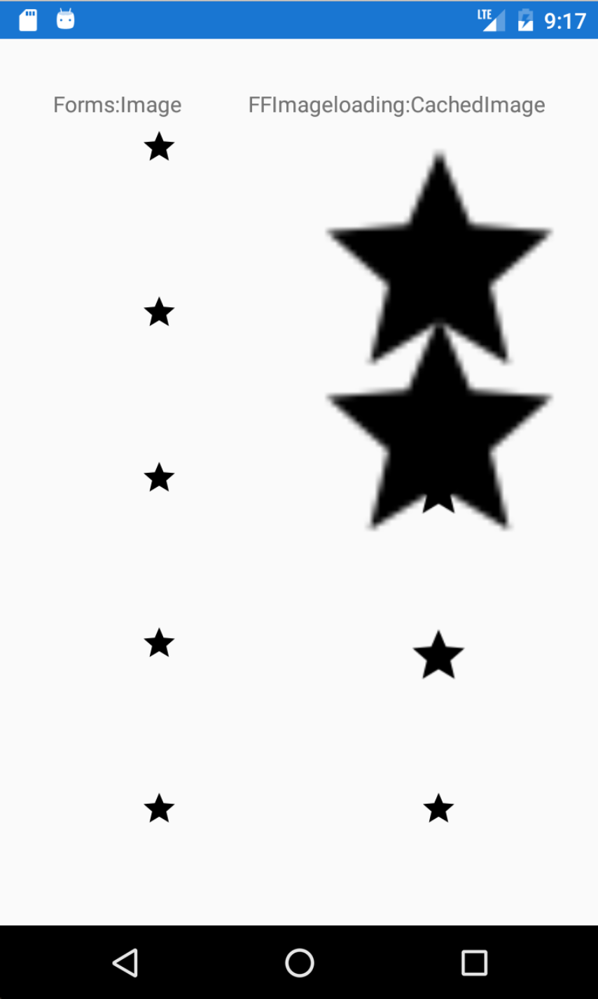
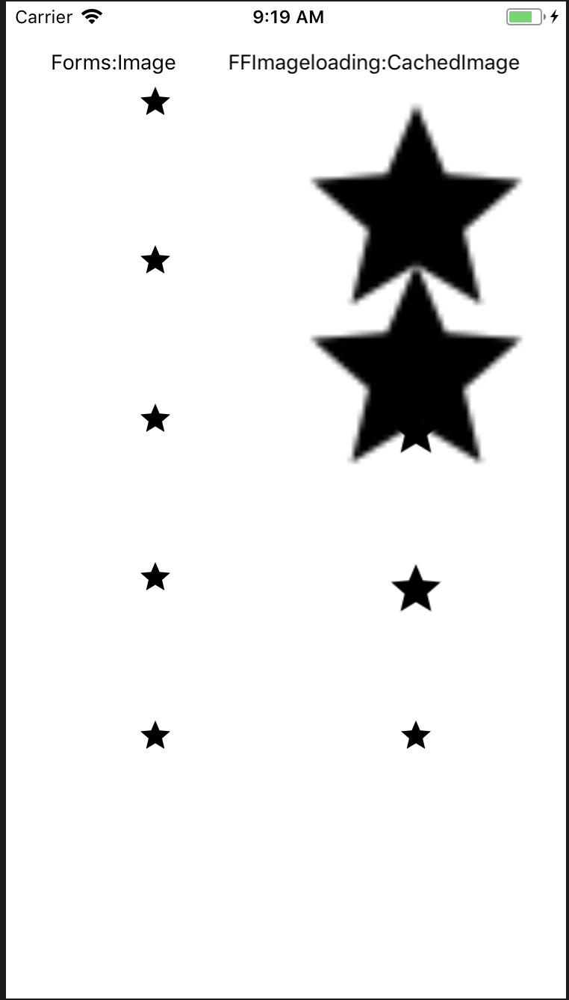

# FFImageLoadingInvestigation
Project to confirm image size behavior based on the OnMeasure fix and varying uses of WidthRequest/HeightRequest, DownsampleWidthRequest/DownsampleHeightRequest, and DownsampleToViewSize

```
                <StackLayout Grid.Column="0" Grid.Row="0" HorizontalOptions="FillAndExpand">
                    <Image HorizontalOptions="Center" Source="ic_star_black_24dp" />
                </StackLayout>

                <StackLayout Grid.Column="1" Grid.Row="0" HorizontalOptions="FillAndExpand">
                    <ffimageloading:CachedImage HorizontalOptions="Center" Source="ic_star_black_24dp" />
                </StackLayout>

                <StackLayout Grid.Column="0" Grid.Row="1" HorizontalOptions="FillAndExpand">
                    <Image HorizontalOptions="Center" Source="ic_star_black_24dp" WidthRequest="24" />
                </StackLayout>

                <StackLayout Grid.Column="1" Grid.Row="1" HorizontalOptions="FillAndExpand">
                    <ffimageloading:CachedImage HorizontalOptions="Center" Source="ic_star_black_24dp" DownsampleToViewSize="true"/>
                </StackLayout>

                <StackLayout Grid.Column="0" Grid.Row="2" HorizontalOptions="FillAndExpand">
                    <Image HorizontalOptions="Center" Source="ic_star_black_24dp" WidthRequest="40"/>
                </StackLayout>

                <StackLayout Grid.Column="1" Grid.Row="2" HorizontalOptions="FillAndExpand">
                    <ffimageloading:CachedImage HorizontalOptions="Center" Source="ic_star_black_24dp" DownsampleToViewSize="true" WidthRequest="40"/>
                </StackLayout>

                <StackLayout Grid.Column="0" Grid.Row="3" HorizontalOptions="FillAndExpand">
                    <Image HorizontalOptions="Center" Source="ic_star_black_24dp" WidthRequest="40"/>
                </StackLayout>
                
                <StackLayout Grid.Column="1" Grid.Row="3" HorizontalOptions="FillAndExpand">
                    <ffimageloading:CachedImage HorizontalOptions="Center" Source="ic_star_black_24dp" DownsampleToViewSize="true" WidthRequest="40" DownsampleWidth="24"/>
                </StackLayout>

                <StackLayout Grid.Column="0" Grid.Row="4" HorizontalOptions="FillAndExpand">
                    <Image HorizontalOptions="Center" Source="ic_star_black_24dp" WidthRequest="24" />
                </StackLayout>
                
                <StackLayout Grid.Column="1" Grid.Row="4" HorizontalOptions="FillAndExpand">
                    <ffimageloading:CachedImage HorizontalOptions="Center" Source="ic_star_black_24dp" DownsampleToViewSize="true" WidthRequest="24"/>
                </StackLayout>
```




